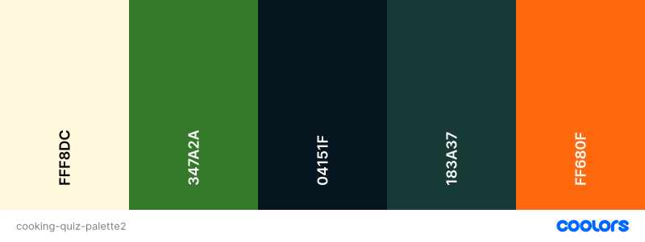

# PP2

## Intro

![Screenshots of PP2 website on different devices]

View PP2 on Github Pages.

![GitHub last commit]![GitHub language count]![GitHub top language]![W3C Validation]

---

## CONTENTS

* [User Experience](#user-experience-ux)
  * [User Stories](#user-stories)

* [Design](#design)
  * [Colour Scheme](#colour-scheme)
  * [Typography](#typography)
  * [Imagery](#imagery)
  * [Wireframes](#wireframes)
 
* [Features](#features)
  * [Header](#header)
  * [Footer](#footer)
  * [Favicon](#favicon)
 
  * [Future Implementations](#future-implementations)
  * [Accessibility](#accessibility)

* [Technologies Used](#technologies-used)
  * [Languages Used](#languages-used)
  * [Frameworks, Libraries & Programs Used](#frameworks-libraries--programs-used)

* [Deployment & Local Development](#deployment--local-development)
  * [Deployment](#deployment)
  * [Local Development](#local-development)
    * [How to Fork](#how-to-fork)
    * [How to Clone](#how-to-clone)

* [Testing](#testing)
  * [Functionality](#functionality)
  * [Browser Compatibility](#browser-compatibility)
  * [Responsiveness](#responsiveness)
  * [HTML and CSS Validation](#html-and-css-validation)
  * [Solved Bugs](#solved-bugs)

* [Credits](#credits)
  * [Code Used](#code-used)
  * [Content](#content)
  * [Media](#media)
  * [Acknowledgments](#acknowledgments)

---

## User Experience (UX)

### User Stories

#### Client Goals

#### First-time Visitor Goals

I want to: 

#### Returning Visitor Goals

I want to: 

#### Frequent Visitor Goals

I want to 

## Design

### Colour Scheme

The colour palette was created using 

### Typography

Google Fonts was used to import the chosen fonts for use in the site.

I chose .  

![Google Fonts example for the site]

### Imagery

The imagery for the site consists of 

### Wireframes

#### Mobile

Mobile
  

 

#### Tablet

Tablet
  

 

#### Laptop / Desktop

Laptop / Desktop
  

 

## Features

The website consists of one continuous page, divided up into sections.  There is a fixed header at the top of the page, and a footer at the bottom.

The site was designed mobile-first and is responsive at every screen size.

The sections are divided into:

### Header

#### Mobile
![Header for mobile]

#### Desktop
![Header for desktop]

The desktop header stretches across the whole viewport, even on very large screens, to give a framing effect to the content below.

The header is fixed, in order to keep the navigation menu in view the whole time, as it is a one-page website and scrolling back to the beginning would be tiresome for the user.

### Footer

#### Mobile
![Footer for mobile]

#### Desktop
![Footer for desktop]

The footer contains links to , using icons from [FontAwesome](https://fontawesome.com/).  There is also a line that credits me as the designer and links to my GitHub.

As with the header, the footer stretches across the whole screen to give a framing effect.

### Favicon

![Favicon]

The favicon for the site was created using [favicon.io](https://favicon.io/favicon-generator/) and uses colours from the site's colour scheme.

### Future Implementations

I would like to add the following features:

### Accessibility

I have tried to make the site as accessible as possible.  Steps that I have been conscious to take are:

* Using semantic HTML
* Choosing fonts that are dyslexia-friendly
* Using descriptive alt attributes on all images 
* Providing aria-labels for screen readers where there are icons used and no text, i.e. the social media icons in the footer
* Ensuring that there is a sufficient colour contrast throughout the site

## Technologies Used

### Languages Used

HTML, CSS and JavaScript were the main languages used to build this site.  

### Frameworks, Libraries & Programs Used

Git - For version control.

Github - To save and store the files for the website.

Gitpod - For developing the site.

Google Fonts - To import the fonts used on the website.

Font Awesome - For the iconography on the website.

Google Dev Tools - To troubleshoot and test features, solve issues with responsiveness and styling.

Lighthouse - Chrome extension used to assess accessibility.

[Shields.io](https://shields.io/) for adding badges to the readme.

[Favicon.io](https://favicon.io/favicon-generator/) for creating a custom favicon.

[Achecks.org](https://www.achecks.org/apca-wcag-3-accessible-colour-contrast-checker/) for checking the colour contrast for accessibility.

[Coolors.co](https://coolors.co) for creating a colour scheme.

[Deque Univerity](https://dequeuniversity.com/rules/axe/4.8/color-contrast) for adjusting colours to meet accessibility standards.

[Beautifier.io](https://beautifier.io/) to format the site's code.

## Deployment & Local Development

### Deployment

The site is deployed using GitHub Pages - [Joan Fleetwood | Actor | Model](https://ejfleet.github.io/joan-fleetwood-actor/).

To Deploy the site using GitHub Pages:

1. Login (or signup) to Github.
2. Go to the repository for this project, [EJFleet/joan-fleetwood-actor](https://github.com/EJFleet/joan-fleetwood-actor).
3. Click the settings button.
4. Select pages in the left hand navigation menu.
5. From the source dropdown select main branch and press save.
6. The site has now been deployed, please note that this process may take a few minutes before the site goes live.

### Local Development

#### How to Fork

To fork the repository:

1. Log in or sign up to [Github](https://github.com/).
2. Go to the repository for this project, [EJFleet/joan-fleetwood-actor](https://github.com/EJFleet/joan-fleetwood-actor).
3. Click the Fork button in the top right corner.

#### How to Clone

To clone the repository:

1. Log in or sign up to [Github](https://github.com/).
2. Go to the repository for this project, [EJFleet/joan-fleetwood-actor](https://github.com/EJFleet/joan-fleetwood-actor).
3. Click on the code button, select whether you would like to clone with HTTPS, SSH or GitHub CLI and copy the link shown.
4. Open the terminal in your code editor and change the current working directory to the location you want to use for the cloned directory.
5. Type 'git clone' into the terminal and then paste the link you copied in step 3. Press enter.

## Testing

### Functionality

|Test Label|Test Action|Expected Outcome|Test Outcome|
|-----|-----|-----|-----|

### Browser Compatibility

The website was tested on:
* Chrome
* Edge
* Safari
* Firefox
* Chrome for Android

### Responsiveness

The site was tested on the following devices: 
* Samsung S9
* Samsung Galaxy S22
* Google Pixel 6
* iPad Pro 2020
* 15.6" Laptop
* Desktop PC

It was extensively tested in Chrome Dev Tools for responsiveness from 300px - 5000px.

### HTML and CSS Validation

I used the W3C Markup Validator and W3C CSS Validator to validate the site and to ensure there were no syntax errors contained therein.

#### HTML

#### CSS

### Lighthouse

I used the Chrome extension Lighthouse to test the site, particularly for Performance and Accessibility.  Results below.

![Lighthouse results]

### Solved Bugs

* Clicked answer-button did not revert back to its original state when the next question was displayed, in mobile view only. 

* 

* 

## Credits

### Code Used

### Content

### Media

  
### Acknowledgments

