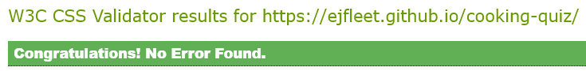
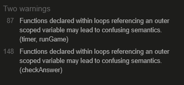

# PP2

## Intro

For my second portfolio project, I chose to design a quiz with questions based on food and cooking.  The user has 30 seconds in which to answer as many questions as possible, with the game ending with either the choosing of a wrong answer or when the timer runs out.

View Emma's Cooking Quiz on [Github Pages](https://ejfleet.github.io/cooking-quiz/)

---

## CONTENTS

* [User Experience](#user-experience-ux)
  * [User Stories](#user-stories)

* [Design](#design)
  * [Colour Scheme](#colour-scheme)
  * [Typography](#typography)
  * [Imagery](#imagery)
  * [Wireframes](#wireframes)
 
* [Features](#features)
  * [Header](#header)
  * [Favicon](#favicon)
  * [Footer](#footer)
  * [Buttons](#buttons)
  * [Timer](#timer)
  * [High Score](#high-score)
  * [Current Score](#current-score)
  * [Final Score](#final-score)
   
  * [Future Implementations](#future-implementations)
  * [Accessibility](#accessibility)

* [Technologies Used](#technologies-used)
  * [Languages Used](#languages-used)
  * [Frameworks, Libraries & Programs Used](#frameworks-libraries--programs-used)

* [Deployment & Local Development](#deployment--local-development)
  * [Deployment](#deployment)
  * [Local Development](#local-development)
    * [How to Fork](#how-to-fork)
    * [How to Clone](#how-to-clone)

* [Testing](#testing)
  * [Functionality](#functionality)
  * [Browser Compatibility](#browser-compatibility)
  * [Responsiveness](#responsiveness)
  * [HTML, CSS and JavaScript Validation](#html-css-and-javascript-validation)
  * [Lighthouse](#lighthouse)
  * [Solved Bugs](#solved-bugs)

* [Credits](#credits)
  * [Code Used](#code-used)
  * [Content](#content)
  * [Acknowledgments](#acknowledgments)

---

## User Experience (UX)

### User Stories

#### First-time Visitor Goals

I want to: 
* Play an entertaining game
* Understand the rules of the game
* Know what is the highest score that has been achieved
* Be told what the correct answer is if I get a question wrong
* See what my score is at the end of the game
* Be given the opportunity to play again

#### Returning Visitor Goals

I want to: 
* Try to beat my highest score
* Answer some questions that I didn't see on the first round

#### Frequent Visitor Goals

I want to:
* Keep improving my score
* Learn new facts about cooking and food

## Design

### Colour Scheme

The colour palette was created using the [Coolors](https://coolors.co/) website.  I checked the accessibility of the colours on [Deque University](https://dequeuniversity.com/rules/axe/4.9/color-contrast) and adjusted the accent colour (orange) to improve the contrast.

The main colours are green for the background (with a gradient that gets lighter from left to right) and orange for the buttons.   The colours were chosen for a clean, fresh look with good contrast and with accessibility at the forefront.

### Typography

Google Fonts was used to import the chosen fonts for use in the site.

I chose to use the Oswald font throughout the site as it looks clean and modern.  It also comes in different weights, which is useful for different headings.

### Imagery

The imagery for the site consists of a small chef's hat for the favicon and a larger version of the same chef's hat for the logo in the header.

### Wireframes

The wireframes that I originally designed have slightly different aesthetic differences to the finished product.  During the construction process, I decided to change the format and layout of the buttons.  I added a timer and also a display for when the game ended due to the timer running out.  The original wireframes are below - though the concept evolved, the original layout is still relevant and can be recognised in the finished site.

#### Mobile

Mobile
  

 

#### Tablet

Tablet
  

 

#### Laptop / Desktop

Laptop / Desktop
  

 

## Features

The website consists of one page with four different containers that are displayed/hidden depending on which stage of the site the user is at - home, game play, game over or time's up.

The site fits into the height of the screen and there is no need for scrolling.

The site was designed mobile-first and is responsive for screens from 320px upwards.

### Header

The header stretches across the whole viewport, even on very large screens, to give a framing effect to the content below.  It contains the title of the site and the logo.

### Favicon

The favicon for the site was downloaded from [Flaticon](https://www.flaticon.com/free-icon/chef-hat_4443003?k=1717963724519&sign-up=google) and is attributed to [Freepik](https://www.flaticon.com/authors/freepik).

### Footer

The footer contains a link to the home page.

As with the header, the footer stretches across the whole screen to give a framing effect.

### Buttons

The buttons are orange with black writing when they are inactive.  When they are hovered over, the writing changes to white and the cursor changes to a pointer finger.

They each have one of three possible functions: 
1.  Start the game;
2.  Answer the question; or
3.  Bring the user back to the home screen.

#### Inactive Button
 

#### Button when hovered over with pointer
 

#### Answer buttons
 

#### Home button in Footer
 

#### Try Again and Home Button at end of game

### Timer

The timer starts at 30 seconds and counts down during the game, with the time remaining displayed for the user.  If the timer runs out, the game ends.  

### High Score

The highest score achieved in the game is displayed on the home screen.  It is saved in local storage.

### Current Score

The user's score starts at 0 on initiation of game play.  This increments by 1 with every correct answer.  

### Final Score

The user's final score is displayed on the panel at the end of the game.

### Future Implementations

I would like to add the following features:

* A notification with a confetti effect for when the user achieves a new high score
* A scoreboard for keeping track of more than one high score
* More questions

### Accessibility

I have tried to make the site as accessible as possible.  Steps that I have been conscious to take are:

* Using semantic HTML
* Choosing a font that is dyslexia-friendly
* Ensuring that there is a sufficient colour contrast throughout the site
* Checking that the size of font is not too small

## Technologies Used

### Languages Used

HTML, CSS and JavaScript were the main languages used to build this site.  

### Frameworks, Libraries & Programs Used

Git - For version control.

Github - To save and store the files for the website.

Gitpod - For developing the site.

Google Fonts - To import the fonts used on the website.

Google Dev Tools - To troubleshoot and test features, solve issues with responsiveness and styling.

Lighthouse - Chrome extension used to assess accessibility.

[Flaticon.com](https://www.flaticon.com/free-icon/chef-hat_4443003) for the favicon and header logo.

[Shields.io](https://shields.io/) for adding badges to the readme.

[Achecks.org](https://www.achecks.org/apca-wcag-3-accessible-colour-contrast-checker/) for checking the colour contrast for accessibility.

[Coolors.co](https://coolors.co) for creating a colour scheme.

[Deque Univerity](https://dequeuniversity.com/rules/axe/4.8/color-contrast) for adjusting colours to meet accessibility standards.

[Beautifier.io](https://beautifier.io/) to format the site's code.

[ImageResizer.com](https://imageresizer.com/) to make the header logo smaller.

[AmIResponsive?](https://ui.dev/amiresponsive) to make the image of the site on different displays.

[Adobe Express Image Resizer](https://www.adobe.com/express/feature/image/resize) for resizing images for this README.

## Deployment & Local Development

### Deployment

The site is deployed using GitHub Pages - [Emma's Cooking Quiz](https://ejfleet.github.io/cooking-quiz).

To Deploy the site using GitHub Pages:

1. Login (or signup) to Github.
2. Go to the repository for this project, [Emma's Cooking Quiz](https://github.com/EJFleet/cooking-quiz).
3. Click the settings button.
4. Select pages in the left hand navigation menu.
5. From the source dropdown select main branch and press save.
6. The site has now been deployed, please note that this process may take a few minutes before the site goes live.

### Local Development

#### How to Fork

To fork the repository:

1. Log in or sign up to [Github](https://github.com/).
2. Go to the repository for this project, [Emma's Cooking Quiz](https://github.com/EJFleet/cooking-quiz).
3. Click the Fork button in the top right corner.

#### How to Clone

To clone the repository:

1. Log in or sign up to [Github](https://github.com/).
2. Go to the repository for this project, [EJFleet/cooking-quiz](https://github.com/EJFleet/cooking-quiz).
3. Click on the code button, select whether you would like to clone with HTTPS, SSH or GitHub CLI and copy the link shown.
4. Open the terminal in your code editor and change the current working directory to the location you want to use for the cloned directory.
5. Type 'git clone' into the terminal and then paste the link you copied in step 3. Press enter.

## Testing

### Functionality

|Test Label|Test Action|Expected Outcome|Test Outcome|
|-----|-----|-----|-----|
|Yes! Let's Go Button|Click button|Game begins|PASS|
|Buttons hover|Hover over button (non-touch screen only)|Text changes to white|PASS|
|Answer buttons (correct)|Click correct answer button|Next question displays|PASS|
|Answer buttons (incorrect)|Click incorrect answer button|'Game Over' panel displays|PASS|
|Your Score|Correct answers are selected|Your Score updates by 1 for each correct answer|PASS|
|Timer runs|Start game|Timer starts at 30 and counts down|PASS|
|Timer ends|Timer runs out|'Time's Up' panel displays|PASS|
|High Score|Get highest number of questions correct|High Score updates on home screen|PASS|
|Try Again button (both end screens)|Click button|Game restarts|PASS|
|Home button (both end screens)|Click button|Brings user back to home screen|PASS|
|Footer home button|Click button|Brings user back to home screen|PASS|

### Browser Compatibility

The website was tested on:
* Chrome
* Edge
* Safari
* Firefox
* Chrome for Android

### Responsiveness

The site was tested on the following devices: 
* Samsung S9
* Samsung Galaxy S22
* Google Pixel 6
* iPad Pro 2020
* 15.6" Laptop
* Desktop PC

It was extensively tested in Chrome Dev Tools for responsiveness from 320px - 5000px.

### HTML, CSS and JavaScript Validation

I used the W3C Markup Validator, W3C CSS Validator and JSHint to validate the site and to ensure there were no syntax errors contained therein.

#### HTML

#### CSS

#### JavaScript

### Lighthouse

I used the Chrome extension Lighthouse to test the site, particularly for Performance and Accessibility.  Results below.

#### Mobile

#### Desktop

### Solved Bugs

* Clicked answer-button not reverting back to its original state when the next question is displayed, in mobile view only. 

  Solved by: 
  1.  using javaScript to construct the buttons each time the displayQuestion() function is called, rather than setting them in HTML;
  2.  using a media query to only use the :hover pseudoclass on devices that can use hover.

* Button text showing up as blue on iPhone.

  Solved by: setting an explicit colour for text in all buttons.

## Credits

### Code Used

* Code Institute's Love Maths project for the initial html and css structuring.

* [MDN](https://developer.mozilla.org/en-US/docs/Web/CSS/box-shadow) for how to do a box shadow correctly

* [Alisha98A's Food Quiz](https://github.com/Alisha98A/Food-Quiz/blob/main/game.html) for how to structure the questions array

* [Naukri Code 360](https://www.naukri.com/code360/library/how-to-create-a-javascript-quiz-code) for the linear gradient of the background

* [This post](https://stackoverflow.com/questions/2450954/how-to-randomize-shuffle-a-javascript-array) on StackOverflow for how to shuffle the questions with a Fisher-Yates shuffle

* [StackOverflow again](https://stackoverflow.com/questions/40532204/media-query-for-devices-supporting-hover) for getting rid of the hover state on the buttons in mobile view

* [MDN](https://developer.mozilla.org/en-US/docs/Web/CSS/@media/any-hover) for the media query only applying a hover state to devices with access to pointers

* [My PP1 project](https://github.com/EJFleet/joan-fleetwood-actor) for the structure of the README.

### Content

* The questions and answers for the game were provided by ChatGPT and edited by me.

### Acknowledgments

* My mentor Brian Macharia for his help, clear explanations and advice on solving a bug
* Amy Richardson for facilitating our weekly standups and being a font of information and encouragement
* My friends and family for testing the project on their devices and offering words of encouragement
